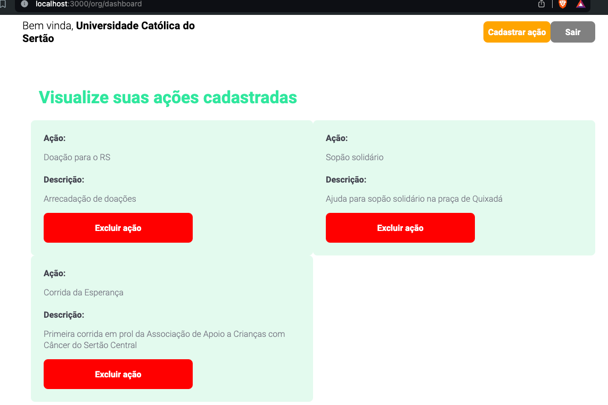
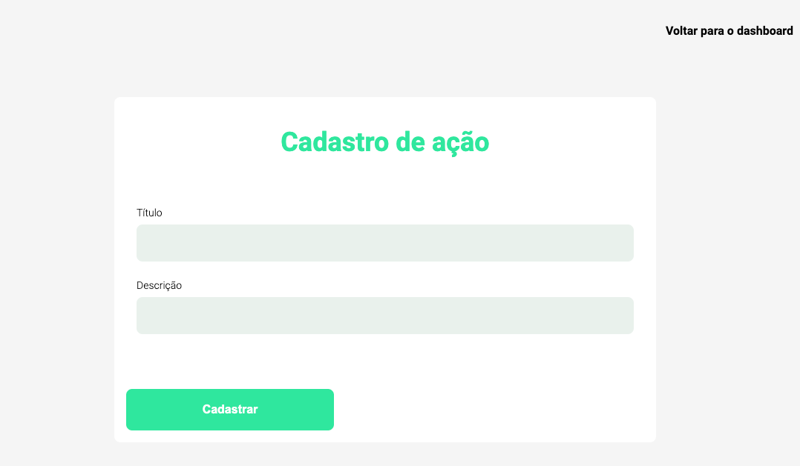
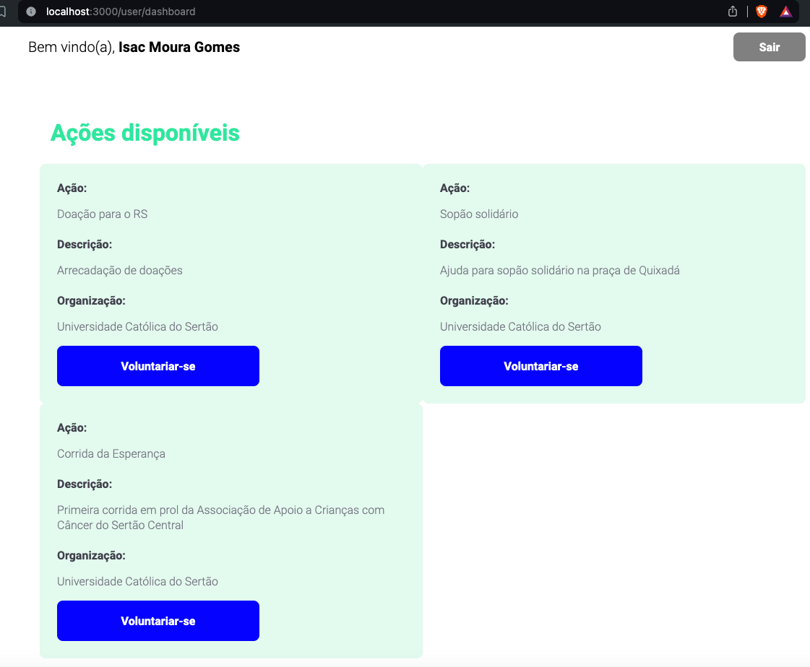

# Eu Ajudo

## Descrição
EuAjudo é uma aplicação web que promove a interação entre os voluntários e as organizações que promovem ações solidárias. Com esta aplicação, vai ser possível que quando um usuário queira se voluntariar em uma ação, precisa somente se cadastrar e verificar quais ações estão disponíveis na aplicação. Uma organização quando quiser promover uma ação, realiza-se o cadastro dos próprios dados, após esse procedimento, cadastra a ação, e assim ficará disponível para os usuários obterem acesso. 

# Instalação e execução
## Pré-requisitos
- [Node JS](https://nodejs.org/en/download/)
- [PostgreSQL](https://www.postgresql.org/download/)

## Passos
- Baixe ou clone este repositório (`git clone https://github.com/isacmoura/EuAjudo.git`)
- Dentro do diretório do projeto, instale as dependências com `npm install`.
- Então execute o comando `npm start`.

# Tecnologias utilizadas
- Javascript 
- HTML5
- CSS3
- Node JS
- JWT
- Knex
- Express
- PostgreSQL
- EJS
